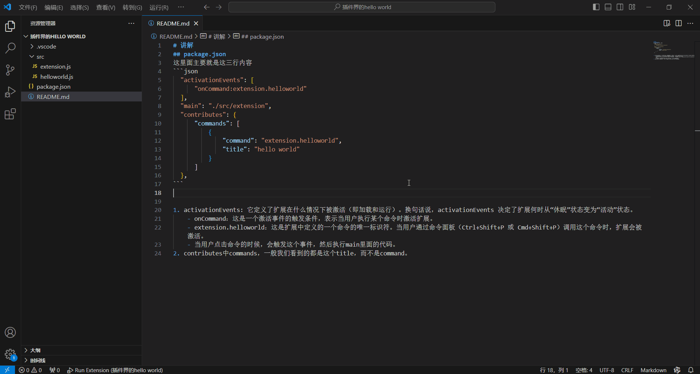

# 讲解
## package.json
这里面主要就是这三行内容
```json
  "activationEvents": [
      "onCommand:extension.helloworld"
  ],
  "main": "./src/extension",
  "contributes": {
      "commands": [
          {
              "command": "extension.helloworld",
              "title": "hello world"
          }
      ]
  },
```


1. activationEvents: 它定义了扩展在什么情况下被激活（即加载和运行）。换句话说，activationEvents 决定了扩展何时从“休眠”状态变为“活动”状态。
    - onCommand：这是一个激活事件的触发条件，表示当用户执行某个命令时激活扩展。
    - extension.helloworld：这是扩展中定义的一个命令的唯一标识符。当用户通过命令面板（Ctrl+Shift+P 或 Cmd+Shift+P）调用这个命令时，扩展会被激活。
    - 当用户点击命令的时候，会触发这个事件，然后执行main里面的代码。
2. contributes中commands，一般我们看到的都是这个title，而不是command。

## extension.js

这里面有exports.activate和exports.deactivate，分别对应插件被激活和释放。

然后在激活时候导入helloworld.js
```js
const vscode = require('vscode');

/**
 * 插件被激活时触发，所有代码总入口
 * @param {*} context 插件上下文
 */
exports.activate = function(context) {
    console.log('恭喜，您的扩展“vscode-plugin-study”已被激活！');
    require('./helloworld')(context); // helloworld

};

/**
 * 插件被释放时触发
 */
exports.deactivate = function() {
    console.log('您的扩展“vscode-plugin-study”已被释放！')
};
```

## helloworld.js
这块内容很简单，
1. 引入vscode模块。
2. 导出一个函数，注册一个名为extension.helloworld的命令。
3. 当命令被触发时，显示信息提示框，内容为hello world。
```js
const vscode = require('vscode');
module.exports = function(context) {
    context.subscriptions.push(vscode.commands.registerCommand('extension.helloworld', (uri) => {
        vscode.window.showInformationMessage(`hello world`);
    }));
};
```

# 运行
使用ctrl+shift+p，弹出命令框，然后输入hello world，就会弹出hello world。


